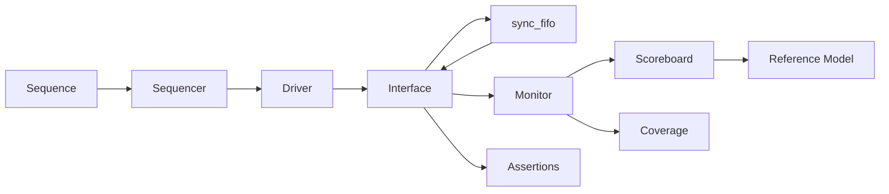

# Parameterized Synchronous FIFO with UVM Verification

[简体中文](README.md) | **English**

A parameterized synchronous FIFO (First In First Out) implemented in SystemVerilog and verified with directed, assertion-based, constrained-random, coverage-driven, and fault-injection tests.

## Highlights

- Parameterized data width and depth.
- Explicit pointer wrap for non-power-of-two depths.
- Registered read output with defined empty-read and full-write behavior.
- Independent queue-based reference model.
- Reusable UVM (Universal Verification Methodology) agent, driver, monitor, scoreboard, and coverage collector.
- Five SVA (SystemVerilog Assertions) properties for temporal protocol checks.
- Deterministic random regression with seed replay.
- Controlled fault injection for testbench qualification.
- One-command full regression.

## Design Contract

| Condition before the clock edge | Write | Read | Count update |
|---|---|---|---|
| Normal write | Accept | - | +1 |
| Normal read | - | Accept | -1 |
| Read and write while neither empty nor full | Accept | Accept | Hold |
| Read and write while empty | Accept | Reject | +1 |
| Read and write while full | Reject | Accept | -1 |
| Read while empty | - | Reject | Hold |
| Write while full | Reject | - | Hold |

`rd_data` is registered. It changes only after a successful read or reset. Reset is asynchronous and active low. The storage array is not reset because the pointers and `data_count` define data validity.

See the complete [design specification](docs/specification.md).

## Verification Architecture



The monitor publishes observed transactions to both the scoreboard and coverage collector. The scoreboard predicts expected behavior through an independent software queue. Assertions check temporal interface rules in parallel.

See the [verification architecture](docs/architecture.md) and [verification plan](docs/verification_plan.md).

## Regression Results

| Suite | Result | Evidence |
|---|---|---|
| Parameterized directed tests | PASS | 5 configurations, 539 checks |
| Layered non-UVM tests | PASS | 5 configurations, 150 comparisons |
| SystemVerilog assertions | PASS | 5 properties exercised, 0 failures |
| UVM regression | PASS | 15/15 groups |
| Constrained-random regression | PASS | 20 seeds, 4,080 comparisons |
| Fault injection | PASS | 3/3 design faults detected |

The latest generated evidence is available in the [full verification summary](reports/full_verification_summary.md) and [UVM regression summary](reports/uvm_regression_summary.md).

## Quick Start

Required tools:

- Git version control
- GNU Make
- Bash
- Icarus Verilog 13.0 or compatible
- Verilator 5.050 or compatible
- A C++ compiler toolchain

Run the complete regression:

```bash
make verify
```

Run individual suites:

```bash
make setup
make directed
make layered
make smoke
make regression
make faults
```

`make setup` installs a pinned Verilator-compatible UVM 2020.3.1 dependency under `.deps/`. Build products, logs, waveforms, and third-party sources are excluded from version control.

## Repository Layout

```text
sync_fifo_uvm/
├── rtl/             synthesizable FIFO design
├── tb/              interface, directed tests, assertions, layered checks
├── uvm/             UVM environment, sequences, and tests
├── scripts/         setup and regression entry points
├── docs/            specification, architecture, plan, matrix, bug reports
├── reports/         generated regression summaries
├── Makefile
├── README.md        Simplified Chinese documentation
└── README.en.md     English documentation
```

The shortest review path is documented in the [code guide](docs/reading_order.md).

## Fault Injection

Three compile-time mutations qualify the verification environment:

1. Incorrect count update during simultaneous read and write.
2. Invalid pointer wrap for a non-power-of-two depth.
3. Data overwrite after a rejected full write.

Each mutation must fail internally for the outer fault test to pass. Root-cause reports are stored under [docs/bug_reports](docs/bug_reports).

## Scope

- Synchronous FIFO only.
- No clock-domain crossing or Gray-code pointers.
- No first-word fall-through mode.
- Verified on Apple Silicon macOS with Icarus Verilog 13.0 and Verilator 5.050.
- Linux and commercial simulator compatibility have not been qualified.

## Terminology

| Term | Full name | Chinese meaning |
|---|---|---|
| FIFO | First In First Out | 先进先出队列 |
| RTL | Register Transfer Level | 寄存器传输级 |
| DUT | Design Under Test | 被测设计 |
| UVM | Universal Verification Methodology | 通用验证方法学 |
| SVA | SystemVerilog Assertions | SystemVerilog 断言 |
| DPI | Direct Programming Interface | 直接编程接口 |
| VPI | Verilog Procedural Interface | Verilog 过程接口 |

## License

[MIT License](LICENSE)
