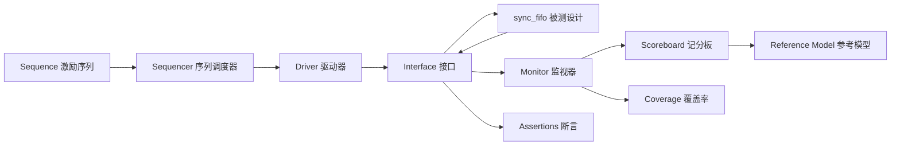

# 参数化同步先进先出队列与通用验证方法学验证

**简体中文** | [English](README.en.md)

本项目使用 SystemVerilog 实现参数化同步 FIFO（First In First Out，先进先出队列），并通过定向测试、断言、约束随机测试、功能覆盖率和故障注入建立完整的验证闭环。

## 项目特性

- 数据位宽和存储深度均可参数化。
- 支持非 2 的整数次幂深度，指针显式回卷。
- 读数据为寄存器输出，空读和满写行为有明确定义。
- 使用独立软件队列建立参考模型，不依赖被测设计内部实现。
- 具备可复用的 UVM（Universal Verification Methodology，通用验证方法学）驱动器、监视器、记分板和覆盖率收集器。
- 使用五条 SVA（SystemVerilog Assertions，SystemVerilog 断言）检查时序行为。
- 支持固定随机种子回归和失败用例重放。
- 使用可控故障注入证明验证环境具备检错能力。
- 使用一条命令运行全部可发布验证项。

## 设计规格

| 时钟沿到来前的状态 | 写请求 | 读请求 | 数据量变化 |
|---|---|---|---|
| 普通写入 | 接受 | - | +1 |
| 普通读取 | - | 接受 | -1 |
| 非空非满时同时读写 | 接受 | 接受 | 保持 |
| 空状态时同时读写 | 接受 | 拒绝 | +1 |
| 满状态时同时读写 | 拒绝 | 接受 | -1 |
| 空状态时读取 | - | 拒绝 | 保持 |
| 满状态时写入 | 拒绝 | - | 保持 |

`rd_data` 是寄存器输出，只在成功读取或复位后改变。复位为低电平有效异步复位。存储阵列不执行复位，因为数据有效性由读写指针和 `data_count` 共同决定。

完整约定见 [设计规格](docs/specification.md)。

## 验证架构



监视器将采集到的事务同时发送给记分板和覆盖率收集器。记分板通过独立队列模型计算期望结果，断言则并行检查时序接口规则。

详细说明见 [验证架构](docs/architecture.md) 和 [验证计划](docs/verification_plan.md)。

## 验证结果

| 验证集 | 结果 | 关键证据 |
|---|---|---|
| 参数化定向测试 | PASS | 5 种配置，539 次自动检查 |
| 非 UVM 分层测试 | PASS | 5 种配置，150 次独立比较 |
| SystemVerilog 断言 | PASS | 5 条性质全部触发，0 失败 |
| UVM 回归 | PASS | 15/15 组 |
| 约束随机回归 | PASS | 20 个种子，4,080 次比较 |
| 故障注入 | PASS | 3/3 类设计错误全部被检出 |

最新生成的证据见 [完整验证报告](reports/full_verification_summary.md) 和 [UVM 回归报告](reports/uvm_regression_summary.md)。

## 快速开始

需要安装：

- Git 版本控制工具
- GNU Make 构建工具
- Bash 命令行解释器
- Icarus Verilog 13.0 或兼容版本
- Verilator 5.050 或兼容版本
- C++ 编译工具链

运行完整验证：

```bash
make verify
```

分别运行各组测试：

```bash
make setup
make directed
make layered
make smoke
make regression
make faults
```

`make setup` 会将固定版本、与 Verilator 兼容的 UVM 2020.3.1 依赖安装到 `.deps/`。构建产物、日志、波形和第三方源码均不会进入版本库。

## 目录结构

```text
sync_fifo_uvm/
├── rtl/             可综合的队列设计
├── tb/              接口、定向测试、断言和分层验证
├── uvm/             UVM 验证环境、激励序列和测试类
├── scripts/         环境安装和自动回归入口
├── docs/            规格、架构、计划、测试矩阵和故障报告
├── reports/         由回归脚本生成的结果汇总
├── Makefile
├── README.md        简体中文说明
└── README.en.md     English documentation
```

建议的最短阅读路径见 [代码阅读指南](docs/reading_order.md)。

## 故障注入

项目包含三种编译期故障，用于证明验证环境的检错能力：

1. 同时读写时错误更新数据量。
2. 非 2 的整数次幂深度下指针错误回卷。
3. 满状态拒绝写入后仍然覆盖存储数据。

故障仿真必须在内部失败，外层故障测试才会判定为通过。根因分析位于 [docs/bug_reports](docs/bug_reports)。

## 项目范围

- 本项目只实现同步先进先出队列。
- 不包含跨时钟域、格雷码指针或异步队列。
- 不包含首字直通模式。
- 已在 Apple Silicon macOS、Icarus Verilog 13.0 和 Verilator 5.050 上完成验证。
- Linux 和商业仿真器兼容性尚未正式验证。

## 术语对照

| 缩写 | 英文全称 | 中文释义 |
|---|---|---|
| FIFO | First In First Out | 先进先出队列 |
| RTL | Register Transfer Level | 寄存器传输级 |
| DUT | Design Under Test | 被测设计 |
| UVM | Universal Verification Methodology | 通用验证方法学 |
| SVA | SystemVerilog Assertions | SystemVerilog 断言 |
| DPI | Direct Programming Interface | 直接编程接口 |
| VPI | Verilog Procedural Interface | Verilog 过程接口 |

## 开源许可

[麻省理工学院开源许可证](LICENSE)
