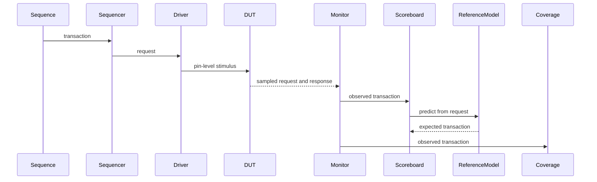

# Verification Architecture

## Data Flow

## Components

| Component | Source | Responsibility |
|---|---|---|
| Sequence item | `fifo_uvm_sequence_item.sv` | Request, response, and transaction identifier |
| Sequences | `fifo_uvm_basic_sequence.sv`, `fifo_uvm_random_sequence.sv` | Directed and constrained-random stimulus |
| Sequencer | `fifo_uvm_sequencer.sv` | Standard sequence-driver arbitration |
| Driver | `fifo_uvm_driver.sv` | Converts transactions into interface timing |
| Monitor | `fifo_uvm_monitor.sv` | Samples interface activity without driving it |
| Reference model | `fifo_uvm_reference_model.sv` | Predicts behavior with an independent queue |
| Scoreboard | `fifo_uvm_scoreboard.sv` | Compares observed and expected transactions |
| Coverage collector | `fifo_uvm_coverage.sv` | Tracks operation, state, cross, and count coverage |
| Agent | `fifo_uvm_agent.sv` | Packages sequencer, driver, and monitor |
| Environment | `fifo_uvm_environment.sv` | Connects agent, scoreboard, and coverage |
| Assertions | `tb/non_uvm/fifo_sva_checker.sv` | Checks five temporal interface properties |

## Timing Model

The driver updates requests on the falling edge. The FIFO processes requests on the rising edge. The monitor samples after nonblocking assignments have updated the design state. Clocking blocks define these scheduling boundaries and avoid testbench-design races.

## Reference-Model Independence

The reference model consumes only `wr_en`, `wr_data`, and `rd_en`. It determines acceptance from its own queue length and never reads design flags, pointers, memory, or `data_count`. This prevents a design error from being duplicated in the expected result.

## Agent Modes

The active agent creates a sequencer, driver, and monitor. The passive agent creates only a monitor and observes externally generated traffic.
