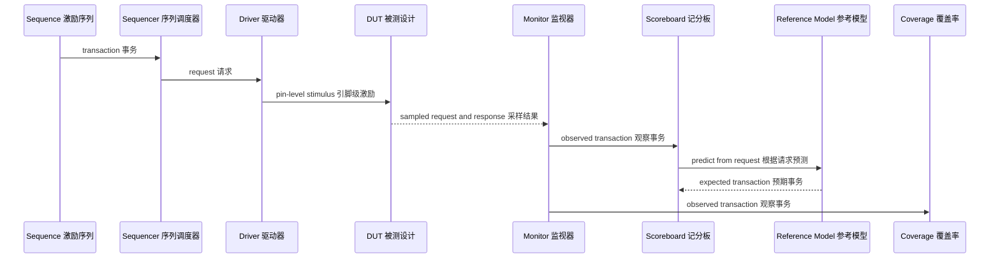

# 验证架构

**简体中文** | [English](architecture.en.md)

## 数据流

## 组件职责

| 组件 | 源文件 | 职责 |
|---|---|---|
| Sequence item，序列事务对象 | `fifo_uvm_sequence_item.sv` | 保存请求、响应和事务编号 |
| Sequences，激励序列 | `fifo_uvm_basic_sequence.sv`、`fifo_uvm_random_sequence.sv` | 产生定向和约束随机激励 |
| Sequencer，序列调度器 | `fifo_uvm_sequencer.sv` | 完成 sequence 与 driver 之间的标准仲裁 |
| Driver，驱动器 | `fifo_uvm_driver.sv` | 把事务转换为接口时序 |
| Monitor，监视器 | `fifo_uvm_monitor.sv` | 只采样接口活动，不驱动信号 |
| Reference model，参考模型 | `fifo_uvm_reference_model.sv` | 使用独立队列预测正确行为 |
| Scoreboard，记分板 | `fifo_uvm_scoreboard.sv` | 比较实际事务与预期事务 |
| Coverage collector，覆盖率收集器 | `fifo_uvm_coverage.sv` | 统计操作、状态、交叉和数据量覆盖率 |
| Agent，代理 | `fifo_uvm_agent.sv` | 封装 sequencer、driver 和 monitor |
| Environment，验证环境 | `fifo_uvm_environment.sv` | 连接 agent、scoreboard 和 coverage collector |
| Assertions，断言 | `tb/non_uvm/fifo_sva_checker.sv` | 检查五条跨周期接口性质 |

## 时序模型

Driver 在时钟下降沿更新请求，FIFO 在上升沿处理请求，Monitor 在非阻塞赋值完成设计状态更新后采样。Clocking block（时钟块）明确这些调度边界，避免 testbench 与设计之间的竞争。

## 参考模型独立性

参考模型只接收 `wr_en`、`wr_data` 和 `rd_en`。它根据自身队列长度判断请求是否被接受，绝不读取 DUT 的状态标志、指针、存储阵列或 `data_count`。这样可以防止同一个设计错误被复制到预期结果中。

## Agent 模式

主动 Agent 创建 sequencer、driver 和 monitor，能够主动产生并驱动事务。被动 Agent 只创建 monitor，用于观察其他模块产生的外部流量。

DUT = Design Under Test，被测设计。

FIFO = First In First Out，先进先出队列。

UVM = Universal Verification Methodology，通用验证方法学。
